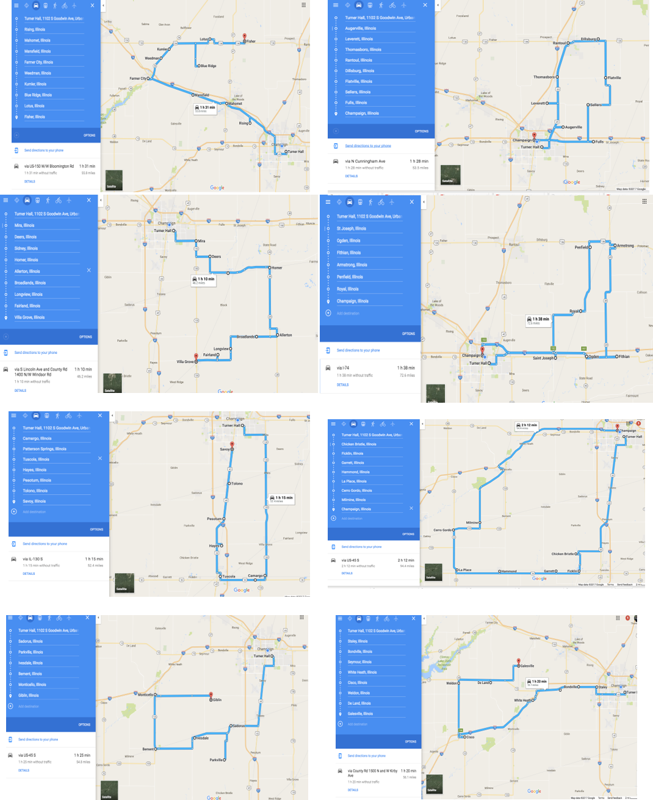
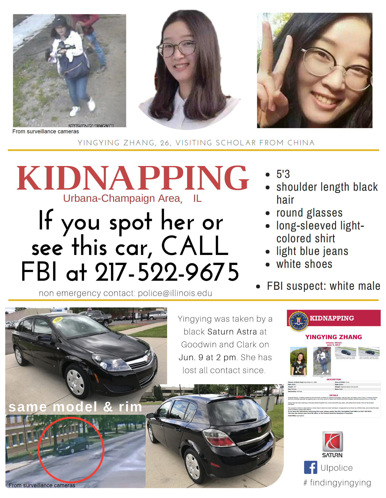

- [FBI 章莹颖页面 | FBI YINGYING ZHANG](https://www.fbi.gov/wanted/kidnap/yingying-zhang)

- [UIUC 章莹颖页面 | UIUC Search Updates](http://police.illinois.edu/search-updates/) 

- [Crime Stoppers 悬赏 | Crime Stopper Reward](http://373tips.com/) 

- [GoFundMe 捐款 | GoFundMe Donation](https://www.gofundme.com/missing-u-of-i-scholar)

- [白宫请愿 | White House Petition](https://petitions.whitehouse.gov/petition/we-are-looking-yingying-zhang-please-help-us)

- [寻找莹颖 | findingyingying](https://findingyingying.github.io/)

- [志愿者寻找莹颖纪事 | Chronicle of finding Yingying](https://findingyingying.github.io/chronicle/chronicle.html)

- [Facebook 寻找莹颖 | Facebook Find Yingying](https://www.facebook.com/findingyingying/)

- [Twitter 寻找莹颖 | Twitter Find Yingying](https://twitter.com/find_yingying)

- [微博 寻找莹颖](http://weibo.com/u/6285125373) 

# 志愿者寻找莹颖纪事

英文版在中文版后 (English version is after the Chinese)

**6月9日, 星期五（第一天）**

1. 莹颖下午1时左右离开实验室(Turner Hall)，告知同事去One North公寓签约。

2. 同事下午5时左右开始电话联系莹颖，电话无人接听。晚饭过后查看莹颖办公室及公寓，未见莹颖。晚上8时左右莹颖同事共同去One North公寓寻找，但工作人员已经下班。晚上9时左右报警。

3. 同事晚上10时与警察来到莹颖公寓，警察进入公寓检查未发现莹颖。

**6月10 日, 星期六（第二天）**

1. 同事一早到警局与警察沟通。

2. 早上10点同事来到One North 公寓leasing office询问莹颖是否来签约，联系office manager获得莹颖与他的短信记录，确认莹颖9日下午未到公寓签约。警察再次来到One North 公寓并尝试追踪莹颖的手机信号。期间，香槟地区华人协会和其他华人群众积极参与到事务中来，并在警局守候两小时。

3. 志愿者建立Finding Yingying微信群。

4. 志愿者分组在学校周边街道、餐馆等公共场所，以及香槟市区的重点区域（共计划分37片区域，地图1）搜寻莹颖下落并分发寻人海报(海报1)。共有上百人参加当日的志愿活动，发出寻人海报超过1200份。 

5. 下午警方说明莹颖手机信号最后出现在火车站（Illinois Terminal）附近，信号出现时间为下午2点30分左右。

6. 志愿者在火车站附近询问出租车司机，有司机说看见疑似莹颖的女生。警察到火车站调监控视频查看并带警犬搜查，但没有发现莹颖踪迹。

7. 傍晚时分，志愿者建立网站([https://findingyingying.github.io](https://findingyingying.github.io/))，发布搜寻莹颖的信息以及召集志愿者工作。

**6月11日，星期日（第三天）**

1. 同事前往警局与案件的专职警探（Detective）沟通；专职警探询问了莹颖失联前的基本信息。
2. 志愿者到公交总站（Illinois Terminal），请公交公司将莹颖失联的消息公布在其网站上，并通知所有公交车司机，留下寻人海报供司机们传看辨认。
3. 志愿者建立周日搜寻群（微信群）。
4. 志愿者推测莹颖可能乘坐的公交路线和时间段。
5. 根据警方建议，上午志愿者在One North公寓附近公园 (地图2)、Lincoln Ave两边居民区分组搜查，并将看到的可能丢弃物拍照，向警方提供有用的信息。
6. 下午，志愿者在莹颖的可能换乘公交线周边（Illini terminal附近三个区域、One North区域、转车区域）继续搜查，包括terminal车站附近居民区。这些寻找基本都为地毯式的细致搜索。
7. 下午5点半左右，警方公布莹颖乘坐公交车监控录相片段。录相显示莹颖自离开实验室后先回家，随后1:30 pm在Orchard Downs公寓South Shelter公交车站上车（12路）、并在Springfield-Mathew intersection下车。发现莹颖没未乘坐往One North的22路公交车。
8. 警方公布录相后，志愿者将Springfield-Mathew Avenue intersection周边划分为四个区域，继续搜查。另有志愿者去公交总站失物招领处，周边工地查看是否有丢失的iphone 5s。
9. 周日，约有近200人参与志愿寻找活动。

**6月12日，星期一（第四天）**

1. 同事去公车总站（Illinois Terminal）失物处查访莹颖丢失手机，被告知只有警方有权提取物证。

2. 上午10点半警方发布莹颖在Goodwin Avenue and Clark公交站与嫌疑人交谈并上车的录像。

3. 同事们在警局与警探再次梳理莹颖失联前后的事情经过。

4. 警方调取监控录像，与FBI合作分辨嫌疑车辆的信息。

5. 志愿者成立信息整理小组，二十余名成员负责收集微信群，Facebook，Twitter，Reddit和群众举报的线索，寻找可突破疑点进行跟进，并向警方提供信息。信息整理小组定期公布官方发布的消息和群众举报线索，配合志愿者进行搜寻工作。信息整理小组工作每日更新。

6. 志愿者根据警方公布视频信息制作了寻找黑色嫌疑车辆海报。

7. 志愿者在香槟城市区，再次划分24片区域 (地图3)，地毯式访察嫌疑车辆，到图书馆、商店、加油站、公园、社区、学校等地点分发印有嫌疑车辆照片的海报（海报2， 1200-1500张海报），和当地居民交谈，寻找可能的线索。

8. 下午三点左右芝加哥领馆余鹏副总领事与侨务组，教育组工作人员从芝加哥来到香槟警局与警方交谈。一行人约四点半来到自然资源与环境科学系，与系主任、莹颖所在实验组、学生会代表及部分志愿者进行交谈。

9. 10:30-11:30 pm同事在警局与FBI专案探员再次仔细梳理失联前后的事情经过。

**6月13日，星期二（第五天）**

1. 上午芝加哥领馆副领事余鹏和学校副校长等八人进行了电话会议，学校表示会全力以赴继续寻找莹颖，并组织专门团队认真准备好接待莹颖家长来访事项。

2. 白天同事配合FBI和警察深入调查，并帮助民众向警方传达线索和消息。

**6月14日，星期三（第六天）**

1. 上午莹颖家人发声明，感谢所有人帮助，并表示在莹颖未找到之前暂时不接受捐款。

2. 志愿者寻访几位疑似目击证人，与他们一一交谈并且请他们及时向警方提供相关线索。 

3. 下午央视记者在学生会的陪同下来到香槟，对警局，莹颖同事和志愿者进行采访。

4. 晚上FBI发布官方公告，将案件定性为绑架，犯罪嫌疑人疑似一名白人男子。

**6月15日，星期四（第七天）**

1. 上午，志愿者在网络发起全美搜寻章莹颖倡议书，倡议全美学校及华人群体行动，线上传播FBI对莹颖失踪的官方通告，并在线下打印，在自己的城市和社区张贴传播。

2. 志愿者根据FBI海报信息制作新版海报(海报3)，重新排版设计，增加了嫌疑车辆的高清图片。

3. 志愿者将搜索范围扩展到香槟外围40多个小村镇，制定八条串连路线（地图4）。超过50名志愿者参加，10多台车辆，累计行程超过1000公里。志愿者们分发FBI通告1000余张，并且与当地居民沟通情况，了解相关信息。

4. 晚上六点校方与警局举办留学生及访问学者安全问题讨论会，会上对莹颖失踪一案作了答疑，警方表示正在全力对嫌疑车辆进行排查。

5. 当晚志愿者建立了寻找莹颖官方微博([http://weibo.com/p/1005056285125373](http://weibo.com/p/1005056285125373))。

**6月16日，星期五（第八天）**

1. 学生会和志愿者加入Facebook上Findingyingying页面管理([https://www.facebook.com/findingyingying/](https://www.facebook.com/findingyingying/))，并对页面并进行推广，以此扩大在美国主流媒体的影响力。

2. 同事和志愿者积极联系美国主流媒体，提供信息并接受采访，希望增加美国全国的公众关注度。

**6月17日，星期六（第九天）**

1. 根据警方最新建议，志愿者制定了新的搜寻计划，将排查的重点放到香槟各大公园、树林、水域等。搜索区域包括香槟市较大的Clinton Lake、Lake of the woods、Allerton Park、Moraine View State Park、Homer Lake Park、Sangamon Park等。共计有10多位志愿者参与到搜寻工作中，同时继续发放FBI通告，与当地居民沟通，了解相关信息。

2. 莹颖家人抵美，由芝加哥领事馆工作人员接机并送到香槟，安顿住宿并与学校、警方见面沟通。

3. 学校为莹颖和家人发起捐款(https://www.gofundme.com/missing-u-of-i-scholar)

4. 同事陪同家人安顿下来，购买了部分生活用品。

**6月18日，星期日（第十天）**

1. 上午莹颖家人与莹颖同事、学生会代表和部分志愿者会面。志愿者向莹颖家人介绍这些天开展的志愿活动，并与家人讨论下一步志愿活动方向。筹建莹颖家人志愿者群组，协助家人在香槟的各项事宜。

**6月19日，星期一（第11天）**

1. 晚上7点，莹颖家人与学校召开新闻发布会，宣布通过Crimestoppers 设立4万美元奖金([www.373tips.com](http://www.373tips.com))，用于奖励寻找莹颖的线索。

**6月20日，星期二（第12天）**

1. 上午生活志愿者开始帮助莹颖家人出行。

2. 下午志愿者帮助莹颖家人协调Fox电视台采访。

3. 下午志愿者翻译莹颖6月19日家人悬赏新闻发布会的视频。

4. 晚上7点，同事、志愿者、学生会代表与莹颖家人一起讨论后续安排。

**6月21日，星期三（第13天）**

1. 志愿者制作新版带4万悬赏的海报。

**6月22日，星期四（第14天）**

1. 上午莹颖家人接受本地媒体News-Gazette采访。

2. 下午2点，志愿者带领莹颖家人去Homer Lake Forest Preserve以及Ogden张贴寻人海报，Fox Illinois记者也参与。

3. 下午6点学校与警局继续召开讨论会，回答公众疑问，参会者讨论如何帮助寻找莹颖。

4. 讨论会后莹颖家人接受WCIA采访。

**6月23日，星期五（第15天）**

1. Jasmine Field Orchestra乐团和志愿者开始筹备莹颖音乐会，曲目来源于莹颖喜欢的音乐。

**6月24日，星期五（第16天）**

1. 在网站上（[https://findingyingying.github.io/](https://findingyingying.github.io/)）发布此寻找莹颖记事（更新到6月24日）。

我们志愿者所做的一切，都为了同一个目标：愿莹颖早日平安归来。

其他：

志愿者建立寻找莹颖网站：[https://findingyingying.github.io/](https://findingyingying.github.io/)

Facebook页面：[https://www.facebook.com/findingyingying/](https://www.facebook.com/findingyingying/)

UIPD警方案件更新页面：[http://police.illinois.edu/search-updates/](http://police.illinois.edu/search-updates/)

学校为莹颖和家人发起捐款链接：[https://www.gofundme.com/missing-u-of-i-scholar](https://www.gofundme.com/missing-u-of-i-scholar)

FBI发布悬赏: [https://www.fbi.gov/wanted/kidnap/yingying-zhang](https://www.fbi.gov/wanted/kidnap/yingying-zhang)

Crime Stopper4万美元悬赏：[http://373tips.com](http://373tips.com)

 

English version:

**Chronicle of finding Yingying**

**June 9, Friday (Day 1)**

1. Yingying left her lab in Turner Hall at 1 pm, notifying her colleague that she was going to One North to sign her lease.

2. Yingying's colleagues started calling her from 5 pm but the phone was not answered. Her colleagues went to Yingying's office as well as her apartment after dinner to look for her but did not find her. Around 8 pm, her colleague went to the One North Apartment to look for her, but the leasing office was closed. Her colleagues called the police at 9 pm.

3. The police and her colleagues went to Yingying's apartment at 10 pm. The police entered her room and found that she was not in the room. 

**June 10, Saturday (Day 2)**

1. Yingying’s colleagues proceeded to UIPD to check the process with the police.

2. At 10 am, Yingying's colleagues went to the One North Apartment to inquire the leasing office if Yingying had signed her lease. It was confirmed that Yingying did not arrive the One North apartment after her SMS conversation with the leasing manager was acquired. Police officials arrived on site to further confirming and attempted to search for Yingying's cellular signal. Meanwhile, concerned members of the Chinese American Association at Champaign and other individuals duly inquired the police and waited for two hours at the police station. 

3. Volunteers also established a WeChat group (Finding yingying) to exchange information about searching plans. 

4. Volunteers were divided into groups to search for Yingying along the streets and in other public places near campus as well as in downtown Champaign-Urbana areas. Volunteers also posted flyers (see flyer 1) with Yingying's information (see map 1). Over 100 volunteers participated in the event and over 1200 flyers were distributed.

5. In the afternoon, police reported that the final detectable cellular signal of Yingying's phone was in the vicinity of Illinois Terminal at 2:30 pm at the day she disappeared.

6. Volunteers inquired taxi drivers near Illinois Terminal and one driver report a possible sighting of a girl similar to Yingying. After check footage of Illinois Terminal’s CCTV and search with the police dog, Yingying was not seen.

7. Towards the evening, volunteers establishing a website ([https://findingyingying.github.io](https://findingyingying.github.io/)) dedicated to posting search updates and recruiting volunteers.

**June 11, Sunday (Day 3)**

1. Yingying's colleagues proceed to UIPD to talk with detectives on the case, who requested for basic information about Yingying.

2. Volunteers arrived at CUMTD headquarters, asking them to publically release info at Yingying's disappearance online and notifying all bus drivers to allow missing flyers of Yingying to be posted on buses.

3. Volunteers establishing a Sunday search group on WeChat.

4. Volunteers deduct the potential times and routes Yingying could have taken.

5. Following advice from the police, in the morning, volunteers proceed to carpet search One North and its vicinity (see map 2) along with two residential areas on Lincoln Ave. Upon search, they found potentially discard items of relevance and reported it to UIPD.

6. In the afternoon, volunteers search along potential routes Yingying could have taken (nearby areas of Illinois Terminal, One North and transfer zones), continuing investigations. This was done through thorough carpet searching. 

7. Around 5:30 pm, the police released footage of Yingying riding the bus. The footage showed that Yingying first returned home after leaving the lab, boarding Route 12 at South Shelter (Orchard Downs) and exiting at Springfield/Matthew. Furthermore, it was confirmed she didn't board Route 22 northbound to One North.

8. After the release of surveillance footage, volunteers search around the vicinity of Springfield/Matthews. Other volunteers inquired CUMTD if they had received an iPhone 5s in their Lost and Found.

9. As of Sunday, approximately 200 volunteers participated in the search.

**June 12, Monday (Day 4)**

1. Her colleague went to the Illinois Terminal lost & found to look for Yingying's missing phone. They were informed that only police has the right to access the lost items.

2. The UIPD released surveillance camera footage at Goodwin Avenue around 10:30 am that showed Yingying got on a black car at the bus stop after talking to the suspect driver.  

3. Her colleagues went to police department to go through every details of Yingying's missing.

4. The police began to collect surveillance video records and in collaboration with FBI to identify the suspected vehicle.

5. Volunteers set up an information collection group with more than 20 members. This group is responsible for collecting useful clue/information from WeChat group, Facebook, Twitter, Reddit, following up leads and providing information to the police. They regularly forward police announcement and summarized clues to the masses and to guide the volunteer work. They publish daily updates and continue to do it until now.

6. Volunteers made the flyer of the black suspected car based on the released video.  

7. Volunteers divided the Urbana-Champaign area into 24 blocks (Map 3) and searched the suspected vehicle in every block. They went to local library, shops, gas stations, parks, communities, schools and other locations to distribute the printed flyer of the suspected vehicle (Flyer 2, 1200-1500 flyers). They also talked to local residents to search for possible clues.

8. Around 3 pm, the Vice-Consul General of the Chinese Consulate at Chicago Yu Peng, the Overseas Chinese Affairs Group, and the education team staff from Chicago to meet and talk to the university police. They also visited the Department of Natural Resources and Environmental Sciences where Yingying worked, and meet the Department chair, Yingying's lab members, CSSA representatives, and volunteers.

9. From 10: 30 to 11: 30 pm, her colleague, the police, and FBI agents together once again carefully went through all the details of Yingying's missing.

**June 13, Tuesday (Day 5)**

1. The Chinese consulate general at Chicago and U of I Vice President along with eight others had a telephone meeting. U of I clarified its full cooperation with the search and organized a special team to prepare for the arrival of Yingying's parents.

2. During the day, Yingying’s colleagues cooperated with members of the police and FBI, passing on relevant information acquired from the community.

**June 14, Wednesday (Day 6)**

1. Yingying's parents released a public statement thanking the community for its help and clarifying that they will not accept donations at this time.

2. Volunteers searched for possible eyewitnesses, talked with them and invited them to give relevant information to the police.

3. CCTV (China Central Television) reporters, under guide of the student council, arrived in Champaign and interviewed police, Yingying's colleagues and volunteers alike.

4. FBI released an official announcement, identifying the incident as a kidnapping and the suspect as a white male.

**June 15, Thursday (Day 7)**

1. Volunteers collectively request for Yingying's search throughout the States in the morning, asking all American universities and Chinese communities to action through spreading the FBI’s official announcement online and to download the flyer and hang up it in their communities.

2. Volunteers created a new flyer with an updated design and high quality pictures of the suspect's car, using the FBI one at its base (see flyer 3)

3. Volunteers expanded their search range to approximately a 40 mile radius and established eight search routes. Over 50 volunteers and 10 cars drove 1000 kilometers in the process, who hanged up over 1000 flyers and talked with locals about the situation.

4. U of I and the police held an international safety forum on campus at 6 pm. They discussed matters of student safety and answered community questions about the search. Officials stated they are working very hard to identify the suspected vehicle.

5. An official Weibo (microblog, similar to Twitter) account for Yingying's search was established that evening.

**June 16, Friday (Day 8)**

1. The CSSA and volunteers joint manage the official Facebook page of Findingyingying and publicized it to further spread the news stateside. 

2. Colleagues and volunteers contacted mainstream media, giving information and interviews in the hopes of increasing attention about the search stateside.

**June 17, Saturday (Day 9)**

1. Following new leads, volunteers established new search routes through Champaign-Urbana’s various parks, woods and ponds. Further searches included nearby secluded areas such as Clinton Lake, Lake of the woods, Allerton Park, Moraine View State Park, Homer Lake Park, Sangamon Park. Over 10 volunteers participated, continuing to post flyers and communicating with locals.

2. Yingying's family arrived in US and escorted to Champaign by consulate workers, given accommodation and discussed matters with the school and police.

3. The university started a donation campaign for Yinying and her family.

4. Colleagues of Yingying's assisted her family into settling in, purchasing necessities for them.

**June 18, Sunday (Day 10)**

1. Yingying's family met Yinying's colleagues, students from CSSA and volunteers. Volunteers introduced their work in the search of Yingying and discussed their future plan with the family. They were also in the preparation of a new volunteer group to help Yingying family's daily life in Champaign. 

**June 19，Monday (Day 11)**

1. At 7 pm, Yingying family and the university held a press conference and announced a $40,000 reward ([www.373tips.com](http://www.373tips.com)) through Crime Stopper for tips that lead to find Yingying.  

**June 20, Tuesday (Day 12)**

1. Starting from today, volunteers began to help Yingying family's transportation.

2. In the afternoon, volunteers helped Yingying family to do an interview with Fox TV.

3. Volunteer translated the Press Conference Video of the $40,000 reward to Chinese.

4. At 7 pm, Yingying's family, her colleagues, volunteers, and student representatives discussed their follow-up plan.

**Wednesday, June 21 (Day 13)**

1. Volunteers updated the flyer of finding Yingying, adding the newly announced $40,000 reward.

**June 22, Thursday (Day 14)**

1. In the morning, Yingying's family had interview by the local media News-Gazette.

2. At 2 pm, volunteers and Yingying's family went to Homer Lake Forest Preserve and Ogden to distribute the new flyers, together with a reporter from Fox Illinois.

3. At 4:30 pm, the police and Yingying's family had a closed discussion.

4. From 6 pm to 7 pm, the university and police continue to hold a forum to answer public questions. The participants also discussed how they can help to find Yingying.

5. After the forum Yingying's family took an interview by WCIA Channel 3。

**June 23, Friday (Day 15)**

1. Jasmine Field Orchestra and volunteers began to prepare a concert for Yingying，where the tracks come from Yingying's favorate music.

**June 24, Saturday (Day 16)**

1. This Chronicle of finding Yingying (updated to June 24) was published on the website ([https://findingyingying.github.io/](https://findingyingying.github.io/)).

Everything we volunteers do is for one common goal: finding Yingying and safely escorting her home

Miscellaneous:

Volunteer established website dedicated to Yingying's search: [https://findingyingying.github.io/](https://findingyingying.github.io/)

Facebook Page: [https://www.facebook.com/findingyingying/](https://www.facebook.com/findingyingying/)

Official UIPD announcement lage: [http://police.illinois.edu/search-updates/](http://police.illinois.edu/search-updates/)

Official university donation campaign for Yingying's family: [https://www.gofundme.com/missing-u-of-i-scholar](https://www.gofundme.com/missing-u-of-i-scholar)

FBI Reward: [https://www.fbi.gov/wanted/kidnap/yingying-zhang](https://www.fbi.gov/wanted/kidnap/yingying-zhang)

$40K reward in Crime Stopper：[http://373tips.com](http://373tips.com)

地图1（重绘图）：6月10日志愿者分组在学校周边街道、餐馆等公共场所，以及香槟市区和的重点区域（37片区）搜寻莹颖下落，分发海报，覆盖各种人群活动区域。

Map 1 (redrawn): On June 10th, volunteers divided Urbana-Champaign area into 37 blocks, posting missing flyers throughout streets, restaurants and public areas of the Champaign area through their comprehensive efforts.

地图2：6月11日，志愿者在One North公寓附近公园分组搜查，将看到的可能丢弃物拍照，向警方提供有用的信息。

Map 2 (scanned): On June 11th, volunteers search the vicinity of One North in groups, snapping pictures of suspicious things and reporting relevant information to the police.

地图3：6月12日，志愿者在香槟城市区，再次划分24片区域，地毯式访察嫌疑车辆，到图书馆、商店、加油站、公园、社区、学校等地点分发印有嫌疑车辆照片的海报，和当地居民交谈，寻找可能的线索。

Map 3: On June 12th, volunteers realigned the Champaign-Urbana area into 24 areas and proceeded to carpet search the vicinity for the suspect's vehicle while posting flyers in libraries, shops, gas stations, larks, communities and parks concerning the suspect's car. They also chatted with locals in attempts to find new clues.

地图4：6月15日，志愿者将搜索范围扩展到香槟外围40多个小村镇，制定八条串连路线。

Map 4: On June 15th, volunteers took to the roads on eight different routes and through 40 villages.

海报1：6月10日分发的寻人海报(上图为修订版)

Flyer 1: June 10th’s flyer (revised version)

海报2：6月12日的分发寻车海报

Flyer 2: June 12th’s flyer concerning the search for the suspect's car

海报3：6月15日分发的海报

Flyer 3: June 15th’ flyer

<!-- Go to www.addthis.com/dashboard to customize your tools --> 

